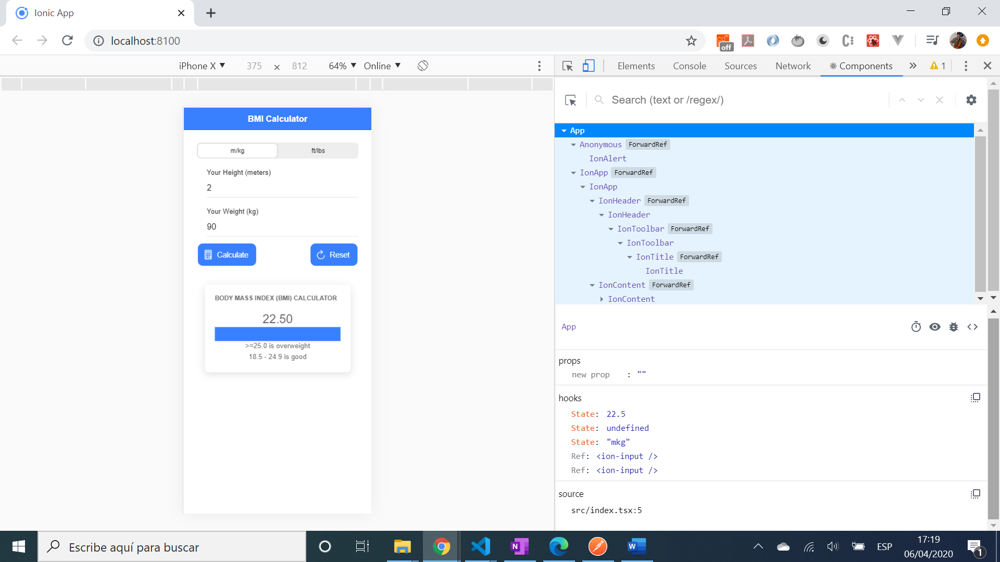

# :zap: Ionic React Scratchpad

* App to calculate the users Body Mass Index (BMI) using inputs of height and weight. Created using the [Ionic 5 framework](https://ionicframework.com/docs) with [React](https://reactjs.org/)].
* Initially Academind: Youtube video: [Ionic + React - Tutorial for Beginners 2020](https://www.youtube.com/watch?v=_03VKmdrxV8) code but with customisations to code and styling.

## :page_facing_up: Table of contents

* [:zap: Ionic React Scratchpad](#zap-ionic-react-scratchpad)
  * [:page_facing_up: Table of contents](#page_facing_up-table-of-contents)
  * [:books: General info](#books-general-info)
  * [:camera: Screenshots](#camera-screenshots)
  * [:signal_strength: Technologies](#signal_strength-technologies)
  * [:floppy_disk: Setup](#floppy_disk-setup)
  * [:computer: Code Examples](#computer-code-examples)
  * [:cool: Features](#cool-features)
  * [:clipboard: Status & To-do list](#clipboard-status--to-do-list)
  * [:clap: Inspiration](#clap-inspiration)
  * [:envelope: Contact](#envelope-contact)

## :books: General info

* App created using Ionic CLI v5

## :camera: Screenshots



## :signal_strength: Technologies

* [Ionic v5](https://ionicframework.com/) framework
* [React v16](https://reactjs.org/) library

## :floppy_disk: Setup

* Load dependencies using `npm i`,
* To start the server on _localhost://8100_ type: 'ionic serve'

## :computer: Code Examples

* function to calculate BMI from user inputs for height & weight

```javascript
const calculateBMI = () => {
  const enteredWeight = weightInputRef.current!.value;
  const enteredHeight = heightInputRef.current!.value;

  if (
    !enteredHeight ||
    !enteredWeight ||
    +enteredHeight <= 0 ||
    +enteredWeight <= 0
  ) {
    setError("Please enter a valid number");
    return;
  }

  const weightConversionFactor = calcUnits === 'ftlbs' ? 2.20 : 1;
  const heightConversionFactor = calcUnits === 'ftlbs' ? 3.28 : 1;

  const weight = +enteredWeight / weightConversionFactor;
  const height = +enteredHeight / heightConversionFactor;

  setCalculatedBmi(weight / (height * height));
};
```

## :cool: Features

* ion cards are responsive so app looks good on PC or mobile screen

## :clipboard: Status & To-do list

* Status: working. Very simple app. Minor error: result card does not disappear when reset button is pressed
* To-do: Fix reset and add functionality

## :clap: Inspiration

* Academind: Youtube video: [Ionic + React - Tutorial for Beginners 2020](https://www.youtube.com/watch?v=_03VKmdrxV8)

## :envelope: Contact

* Repo created by [ABateman](https://www.andrewbateman.org) - you are welcome to [send me a message](https://andrewbateman.org/contact)
